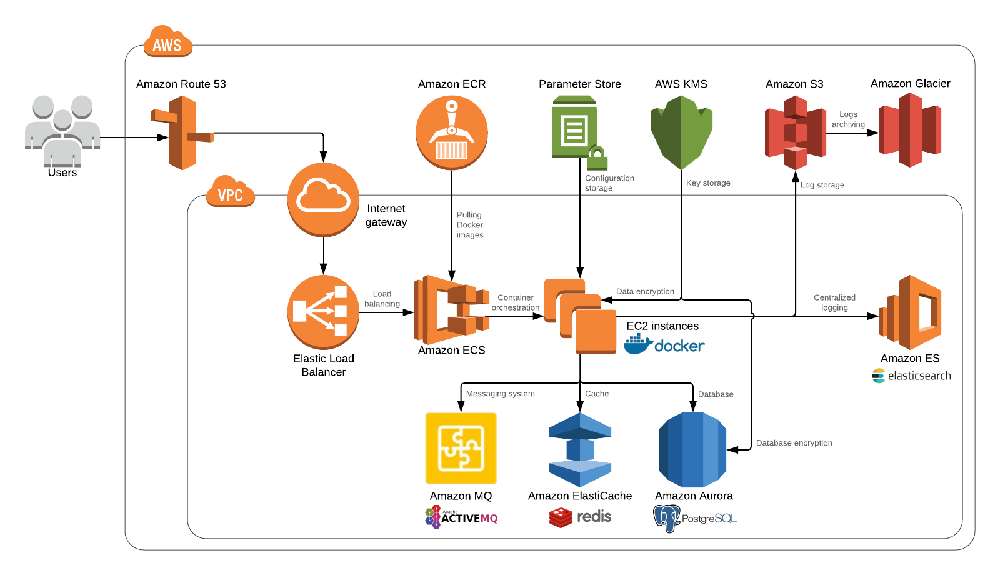
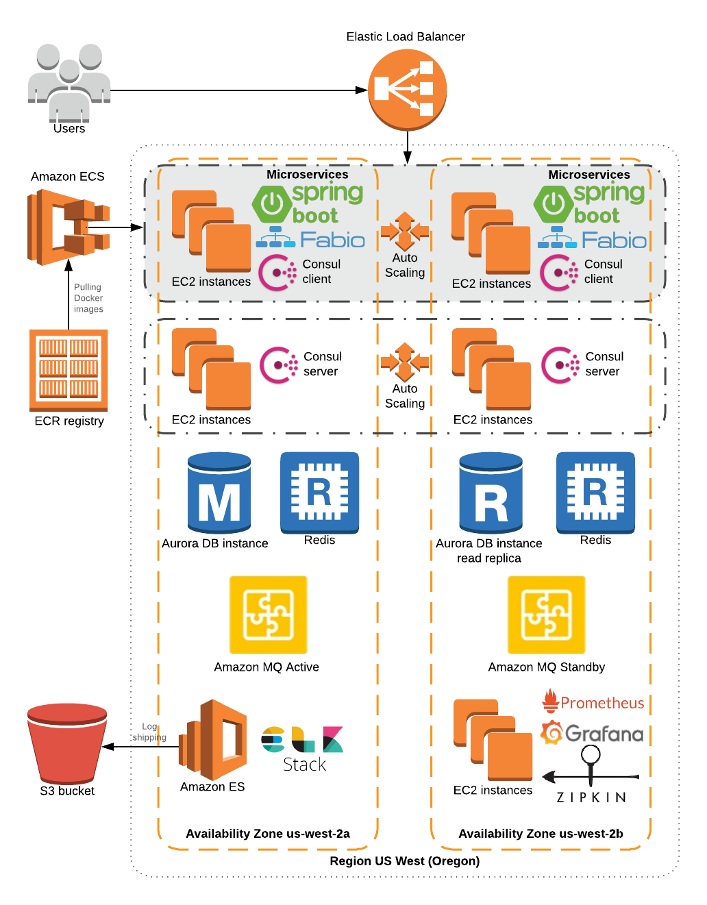
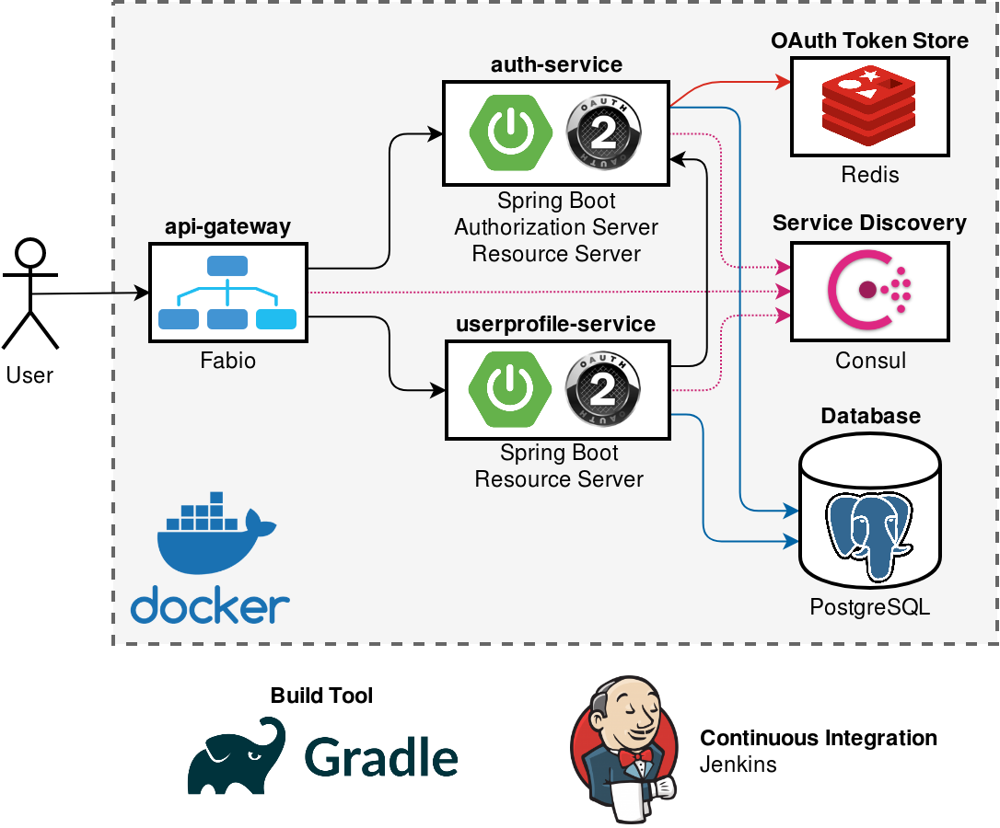
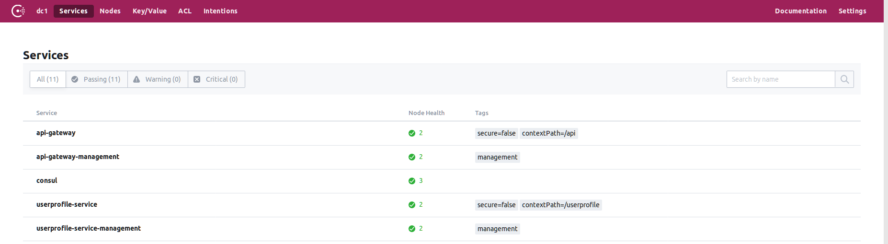
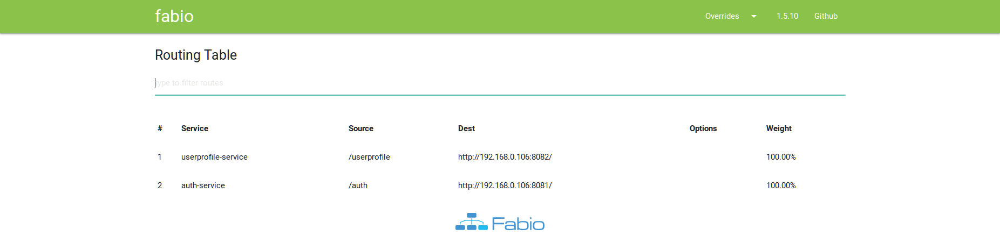

# Moso PoC

## Overview

The goal of this Proof of Concept is to demonstrate how solutions that should run on the target AWS infrastructure may look like.

## AWS Architecture Blueprint





## Proof of Concept Architecture Diagram



Proof of Concept consists of 2 Microservices:

* **auth-service** - OAuth 2.0 Authorization and *User* Resource Server
* **userprofile-service** - OAuth 2.0 *User Profile* Resource Server that uses *auth-service* as the Authorization Server

The following external systems are used:

* [**HashiCorp Consul**](https://www.consul.io/) is used for the Service Discovery. Thanks to Consul, Microservices don't have to know about each others location.
* [**Fabio**](https://fabiolb.net/) is used as an API Gateway, a single entry-point to the system responsible for routing the requests. *Fabio* configures itself with data from Consul.
* [**PostgreSQL**](https://www.postgresql.org/) - relational database for storing Users and User Profiels.
* [**Redis**](https://redis.io/) - high-performance in-memory key-value store used for storing OAuth 2.0 Tokens.

Microservices are built by **Gradle** from the **Jenkins** CI pipelines described in the **Jenkinsfile**s.

Microservices are distributed as **Docker** images what makes them portable.

## Prerequisites

In order to build and run this samples you will need:

* Git
* Java 8 JDK
* Docker CE
* Docker Compose

## How to Build and Run the Samples 

For simplicity, all Microservices are located in the same Git repo what should be avoided in the real development.

All external systems required by Microservices can be run in Docker containers:

```bash
cd <REPO_PATH>/deployment
docker-compose up -d
``` 

This command will start Consul Servers and Agent, Fabio, PostgreSQL and Redis and expose their ports locally.

**Note**: In this document all commands are for Linux and Mac. If you are using Windows commands may differ (e.g. Linux - `./gradlew build`, Windows - `gradlew build`).

Build and run the Microservices:

```bash
cd <REPO_PATH>/auth-service
./gradlew clean build bootRun
```

```bash
cd <REPO_PATH>/userprofile-service
./gradlew clean build bootRun
```

Open Consul UI (http://localhost:8500/ui/) to check that all Microservices are running:



Open Fabio UI (http://localhost:9998/) to check that all Microservices are registered in the API Gateway routing table:



## Microservices Sample Usage

Open the Linux or Mac Terminal (or Git Bash on Windows) and run the following commands.

Get the Auth Token for the predefined Superuser:

```bash
curl moso:moso@localhost:9999/auth/oauth/token -d grant_type=password -d username=superuser@moso.com -d password=s3cr3t
```

Response example:

```json
{"access_token":"8b11dbc0-bbd3-427e-b1bd-04c13c5ff150","token_type":"bearer","refresh_token":"2d6e1919-d939-4a49-b414-c53dbc1f0f8d","expires_in":39264,"scope":"all"}
```

Get the User details by the Auth Token:

```bash
curl moso:moso@localhost:9999/auth/oauth/check_token -d token=<superuser_access_token>
```

Response example:

```json
{"active":true,"exp":1541238992,"user_name":"superuser@moso.com","authorities":["ROLE_SUPERUSER","ROLE_ADMIN"],"client_id":"moso","scope":["all"]}
```

Refresh the Auth Token:

```bash
curl moso:moso@localhost:9999/auth/oauth/token -d grant_type=refresh_token -d refresh_token=<superuser_refresh_token>
```

Response example:

```json
{"access_token":"04cf0773-bd3f-4bc3-a3ed-6a10525cf6ee","token_type":"bearer","refresh_token":"2d6e1919-d939-4a49-b414-c53dbc1f0f8d","expires_in":43199,"scope":"all"}
```

Create a new User with the *ADMIN* Role:

```bash
curl -X PUT localhost:9999/auth/users/ -d '{"email":"admin@moso.com","password":"s3cr3t","roles":["ADMIN"]}' -H "Content-Type: application/json" -H "Authorization: Bearer <superuser_access_token>"
```

Get the Auth Token for the Admin user that has been just created:

```bash
curl moso:moso@localhost:9999/auth/oauth/token -d grant_type=password -d username=admin@moso.com -d password=s3cr3t
```

Response example:

```json
{"access_token":"18f78410-6810-420c-8faa-40ac522dda5a","token_type":"bearer","refresh_token":"cf3d2fba-8e5f-4c76-ac86-1bf0cad21324","expires_in":39149,"scope":"all"}
```

Get currently authenticated User details: 

```bash
curl localhost:9999/auth/users/me -H "Authorization: Bearer <admin_access_token>"
```

Response example:

```json
{"email":"admin@moso.com","roles":["ADMIN"]}
```

Only Users with the Role *SUPERUSER* can create new Users, so the attempt to create the User by the Admin will fail:

```bash
curl -X PUT localhost:9999/auth/users/ -d '{"email":"admin2@moso.com","password":"s3cr3t","roles":["ADMIN"]}' -H "Content-Type: application/json" -H "Authorization: Bearer <admin_access_token>"
```

Response example:

```json
{"error":"access_denied","error_description":"Access is denied"}
```

Create a User Profile for the Superuser:

```bash
curl -X PUT localhost:9999/userprofile/user-profiles/ -d '{"email":"superuser@moso.com","firstName":"Superuser","lastName":"Moso"}' -H "Content-Type: application/json" -H "Authorization: Bearer <superuser_access_token>"
```

Get the created Superuser User Profile:

```bash
curl http://localhost:9999/userprofile/user-profiles/me -H "Authorization: Bearer <superuser_acceess_token>"
```

Response example:

```json
{"email":"superuser@moso.com","firstName":"Superuser","middleName":null,"lastName":"Moso","phoneNumber":null}
```

Create a User Profile for the Admin:

```bash
curl -X PUT localhost:9999/userprofile/user-profiles/ -d '{"email":"admin@moso.com","firstName":"Admin","lastName":"Moso"}' -H "Content-Type: application/json" -H "Authorization: Bearer <admin_access_token>"
```

Get the created Admin User Profile:

```bash
curl http://localhost:9999/userprofile/user-profiles/me -H "Authorization: Bearer <admin_access_token>"
```

Response example:

```json
{"email":"admin@moso.com","firstName":"Admin","middleName":null,"lastName":"Moso","phoneNumber":null}
```

Admin can edit only his own User Profile, so the attempt to edit Superuser's User Profile will fail:

```bash
curl -X PUT localhost:9999/userprofile/user-profiles/ -d '{"email":"superuser@moso.com","firstName":"Superuser2","lastName":"Moso"}' -H "Content-Type: application/json" -H "Authorization: Bearer <admin_access_token>"
```

Response example:

```json
{"error":"access_denied","error_description":"Access is denied"}
```

Stop *auth-service* and *userprofile-service* by pressing `Ctrl+C` in the terminals where tey were started.

Stop Docker containers with external systems by running:

```bash
cd <REPO_PATH>/deployment
docker-compose down
```

## Continuous Integration

For simplicity, Jenkins for this sample will be run locally in the Docker container what should be avoided in the real development.

Start Jenkins by running:

```bash
cd <REPO_PATH>/continuous-integration
docker-compose up -d
```

Run the following command to get the Initial Admin Password:

```bash
docker-compose exec jenkins cat /var/jenkins_home/secrets/initialAdminPassword
```

Copy the password.

Open Jenkins http://localhost:58080

1. Paste the password into the "Administrator password" field
2. Press the "Continue" button
3. Press the "Install suggested plugins" button
4. Create the first admin user
5. Press the "Save and Finish" button
6. Press the "Start using Jenkins" button

Create credentials to the remote Git repository by opening URL http://localhost:58080/credentials/store/system/domain/_/newCredentials

1. Set the "ID" field value to "bitbucket-credentials"
2. Fill the "Username" and "Password" fields
3. Press the "OK" button

Create a build job for **auth-service** by opening URL http://localhost:58080/view/all/newJob

1. Enter an item name "auth-service"
2. Select the "Pipeline" type
3. Press the "OK" button
4. Go to the "Pipeline" section 
5. In the "Definition" select "Pipeline script from SCM"
5. In the "SCM" select "Git"
6. Set the "Repository URL" to "https://bitbucket.org/evgeniy-khist/moso-poc.git" (or other Git repo)
7. In the "Credentials" select previously created credentials
8. Set "Script Path" to "auth-service/Jenkinsfile"
9. Press the "Save" button
10. Run the build by pressing the "Build Now" button

Create a build job for **userprofile-service** by opening URL http://localhost:58080/view/all/newJob

1. Enter an item name "userprofile-service"
2. Set "Copy from" to "auth-service"
3. Change "Script Path" to "userprofile-service/Jenkinsfile"
4. Press the "Save" button
5. Run the build by pressing the "Build Now" button

Create a build job for deploying all Microservices by opening URL http://localhost:58080/view/all/newJob

1. Enter an item name "deployment"
2. Set "Copy from" to "auth-service"
3. Change "Script Path" to "deployment/Jenkinsfile"
4. Press the "Save" button
5. Run the build by pressing the "Build Now" button

The result should look like this:


After waiting a few minutes to give all services to start, open Consul UI (http://localhost:8500/ui/) and Fabio UI (http://localhost:9998/) to check that all Microservices are successfully started and registered.

Also check that API is reachable by getting the Auth Token for the predefined Superuser:

```bash
curl moso:moso@localhost:9999/auth/oauth/token -d grant_type=password -d username=superuser@moso.com -d password=s3cr3t
```
